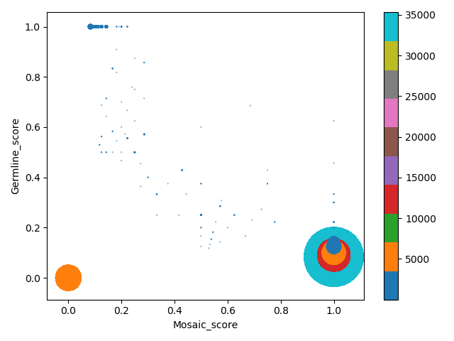

# All2
A tool for filtering variants from all2all comparison of multiple clones or single cells

## **Prerequisite:**
1. Python 3.6 with the following packages
	1. Pandas
	1. Matplotlib
	1. Seaborn
	1. Numpy
1. Other dependencies:
    1. Samtools
    
## **Setup:** 
### Download
   ```
      git clone https://github.com/abyzovlab/Scellector.git    
   ```
### Downloading Samtools and reference
1. Samtools (download and install):
     ```
     wget https://sourceforge.net/projects/samtools/files/samtools/1.9/samtools-1.9.tar.bz2
    
     tar -xvf samtools-1.9.tar.bz2
    
    cd samtools-1.9/
    
    /.configure
    
    make
     ```
1. Reference (If you want to run the examples and is not a requirement):

    ```
    wget ftp://gsapubftp-anonymous@ftp.broadinstitute.org/bundle/b37/human_g1k_v37_decoy.fasta.gz
    
    wget ftp://gsapubftp-anonymous@ftp.broadinstitute.org/bundle/b37/human_g1k_v37_decoy.fasta.fai.gz
    
    gunzip human_g1k_v37_decoy.fasta.gz
    
    gunzip human_g1k_v37_decoy.fasta.fai.gz
   ```
   
 ## How to use All2:
 The All2 script can be run using three commands.
 ```
python ALL2.py -h
usage:  python ALL2.py <command> [<args>]
        Three commands to use:
                score --> Generates mosaic and germline scores.
                call --> Based on score cut-off generates sample level files/plots for mosaic,
                        germline mutations and plots variant allele frequency, mutation spectrum
                matrix --> Plot the mutation matrix
                

All to all comparision

positional arguments:
  command     Please specify score/call/matrix as a command

optional arguments:
  -h, --help  show this help message and exit

example:
python ALL2.py score -m manifest_file.txt -o output_example/
 ```
### score: 
This is the first step and the other two commands will need the output from this step.
#### Input
This options takes in a manifest file and output directory as its input. The manifest
file should have the following format (see manifest_file.txt):

#Control|Case|Filename
---|---|---
control_1|case_1|path/to/file_1_1.vcf
control_1|case_2|path/to/file_1_2.vcf
....|....|....
control_n|case_m|path/to/file_n_m.vcf
##### Note:
1. Make sure that the name of control and case in the manifest file match the 
control and case name in the vcf file. (exception: TUMOR/NORMAL naming is acceptable
but not recommended)
1. Make sure to vcf files for all the combination of control and case
specified in the vcf.
1. It is recommended to filter the vcf (technical artifacts) prior to running All2 to reduce 
the processing time. If this is not performed, script will automatically 
spiteout the noise, but might take longer.

#### Usage
```
python ALL2.py score -h
usage: ALL2.py [-h] -m MANIFEST_FILE -o OUTPUT_DIR

get_score

optional arguments:
  -h, --help            show this help message and exit
  -m MANIFEST_FILE, --manifest_file MANIFEST_FILE
                        Path to manifest file
  -o OUTPUT_DIR, --output_dir OUTPUT_DIR
                        Path to directory where results will be written


```
 #### Output
 It generates three output files:
 1. "explanation_score.txt" which has the following information:
 
    Field_name|Explanation
    ---|---
    **Chrom**| Chromosome name 
    **Pos**| Position of the mutation
    **Ref**| Reference allele
    **Alt**| Alternate allele
    **Mosaic_score**| Mosaic score for the mutation
    **Germline_score**| Germline score for the mutation
    **Number_of_samples_with_mutation**| Number of samples/pairs where the mutation was called
    **Samples_with_mutation**| Name of the samples which have the mutation (comma separated values)
    **VAF_of_samples_with_mutation**| Variant allele frequency for the mutation for each sample (comma separated values)
    **Number_of_comparision_per_sample**| Number of comparison where this mutation was found in a sample(comma separated value)
 1. "Explaination_score_scatter.png" which shows the distribution of 
 mutations in terms of mosaic and germline scores. This plot is helpful to 
 determine the mosaic and germline score to use for calling mosaic and germline 
 mutations in the next 'call' step. The size of the circle denotes the number
 of mutations.
 
    
 1. "mutation_matrix.pkl" is an pickle file generated to be used for matrix 
 visualisation in the 'matrix' option. This in no use for the user.

### call:
This is next step after score to call the mosaic mutation based on user defined
mosaic and germline score cutoff.

#### Input
#### Usage
#### Output