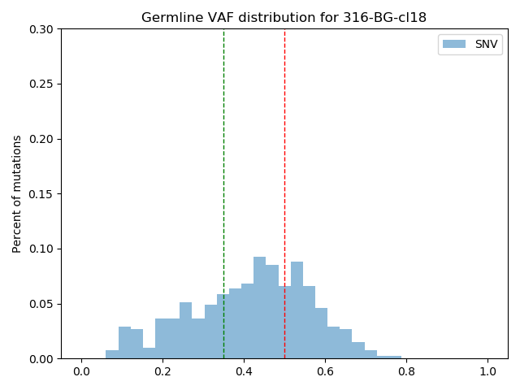
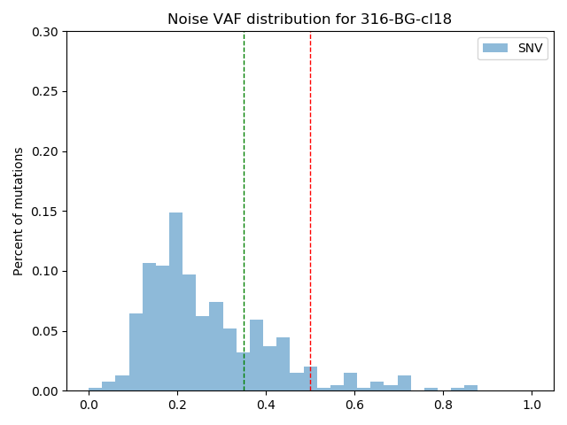
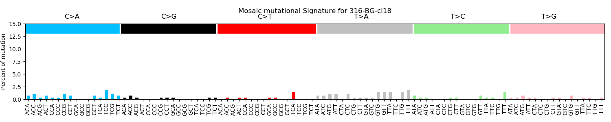
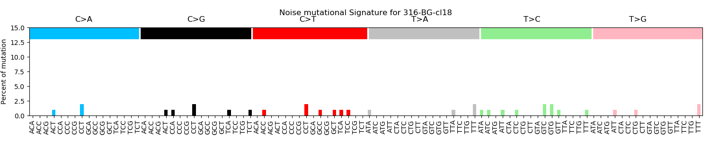

# All2
A tool for filtering variants from all2all comparison of multiple clones or single cells

## **Prerequisite:**
1. Python 3.6 with the following packages
	1. Pandas
	1. Matplotlib
	1. Seaborn
	1. Numpy
1. Other dependencies:
    1. Samtools
    
## **Setup:** 
### Download
   ```
      git clone https://github.com/abyzovlab/Scellector.git    
   ```
### Downloading Samtools and reference
1. Samtools (download and install):
     ```
     wget https://sourceforge.net/projects/samtools/files/samtools/1.9/samtools-1.9.tar.bz2
    
     tar -xvf samtools-1.9.tar.bz2
    
    cd samtools-1.9/
    
    /.configure
    
    make
     ```
1. Reference (If you want to run the examples and is not a requirement):

    ```
    wget ftp://gsapubftp-anonymous@ftp.broadinstitute.org/bundle/b37/human_g1k_v37_decoy.fasta.gz
    
    wget ftp://gsapubftp-anonymous@ftp.broadinstitute.org/bundle/b37/human_g1k_v37_decoy.fasta.fai.gz
    
    gunzip human_g1k_v37_decoy.fasta.gz
    
    gunzip human_g1k_v37_decoy.fasta.fai.gz
   ```
   
 ## How to use All2:
 The All2 tool has three commands for SNVs and small INDELs:
 1. score
 1. call
 1. matrix
 
 And three commands for structural variants:
 1. score_sv
 1. call_sv
 1. matrix_sv
 
 Note: The options and outputs for SNVs, INDELs and SV are similar, however please keep the following in mind:
 1. For structural variants, the only accepted tool is Manta and script doesn't include 'BND' variants
 1. Since there is no variant allele frequency available for structural variants from manta the 'call_sv' option
 is slightly different than the 'call' option.
 1. There are no variant allele frequency and mutation spectrum plots for structural variant mode and the format
 of the output files will be slightly different from the SNV/INDEL analyses.
 ### Usage
 ```
python ALL2.py -h
usage:  python ALL2.py <command> [<args>]
        Three commands to use for SNVs and small INDELS:
                score --> Generates mosaic and germline scores.
                call --> Based on score cut-off generates sample level files/plots for mosaic,
                        germline mutations and plots variant allele frequency, mutation spectrum
                matrix --> Plot the mutation matrix
        Three commands to use for structural variants :
                score_sv --> Generates mosaic and germline scores.
                call_sv --> Based on score cut-off generates sample level files/plots for mosaic and 
                        germline mutations 
                matrix_sv --> Plot the mutation matrix              

All to all comparision

positional arguments:
  command     Please specify score/call/matrix as a command

optional arguments:
  -h, --help  show this help message and exit
 ```
*note
### 1. score: 
This is the first step and the other two commands will need the output from this step.
#### Input
This options takes in a manifest file and output directory as its input. The manifest
file should have the following format (see manifest_file.txt):

#Control|Case|Control_in_vcf|Case_in_vcf|Filename|Inclusion_region
---|---|---|---|---|---
control_1|case_1|control_in_vcf_1|case_in_vcf_1|path/to/file_1_1.vcf|path/to/file_1.bed
control_1|case_2|control_in_vcf_1|case_in_vcf_2|path/to/file_1_2.vcf|path/to/file_2.bed
....|....|....|....|....|....
control_n|case_m|control_in_vcf_n|case_in_vcf_m|path/to/file_n_m.vcf|path/to/file_m.bed
##### Note:
1. The columns "Control_in_vcf" and "Case_in_vcf" are optional and can be used when the 
"Control" and "Case" name don't match the control and case inside the vcf file.
1. Make sure to vcf files for all the combination of control and case
specified in the vcf.
1. It is recommended to filter the vcf (technical artifacts) prior to running All2 to reduce 
the processing time. If this is not performed, script will automatically 
filter the noise, but might take longer.
1. The script automatically used only "PASS" variants and if you wish to use 
all variants use the option "-a"

#### Usage
```
python ALL2.py score -h
usage: ALL2.py [-h] -m MANIFEST_FILE -o OUTPUT_DIR

get_score

optional arguments:
  -h, --help            show this help message and exit
  -m MANIFEST_FILE, --manifest_file MANIFEST_FILE
                        Path to manifest file
  -o OUTPUT_DIR, --output_dir OUTPUT_DIR
                        Path to directory where results will be written

example:
python ALL2.py score -m manifest_file.txt -o output_example/
```
 #### Output
 It generates three output files:
 1. "explanation_score.txt" which has the following information:
 
    Field_name|Explanation
    ---|---
    **Chrom**| Chromosome name 
    **Pos**| Position of the mutation
    **Ref**| Reference allele
    **Alt**| Alternate allele
    **Mosaic_score**| Mosaic score for the mutation
    **Germline_score**| Germline score for the mutation
    **Total_samples**| Total number of samples in the study
    **Number_of_samples_with_mutation**| Number of samples/pairs where the mutation was called
    **Samples_with_mutation**| Name of the samples which have the mutation (comma separated values)
    **VAF_of_samples_with_mutation**| Variant allele frequency for the mutation for each sample (comma separated values)
    **Number_of_comparision_per_sample**| Number of comparison where this mutation was found in a sample(comma separated value)
    **Excluded_samples**| Samples excluded because of allele drop out
 1. "Explanation_score_scatter.png" which shows the distribution of 
 mutations in terms of mosaic and germline scores. This plot is helpful to 
 determine the mosaic and germline score to use for calling mosaic and germline 
 mutations in the next 'call' step. The size of the circle denotes the number
 of mutations.
 
    
 1. "mutation_matrix.pkl" is an pickle file generated to be used for matrix 
 visualisation in the 'matrix' option. This in no use for the user.

### 2. call:
This is next step after score to call the mosaic mutation based on user defined
mosaic and germline score cutoff.

#### Input
It takes three required parameters:
1. The output directory from the 'score' command (GET_SCORE_DIRECTORY).
1. Genome reference that was used to generate the vcf files.
1. Output directory.

And five optional parameter:
1. Allele frequency cut-off for mutations (default is 35%)
1. Mosaic score cut-off (default is 0.75)
1. Germline score cut-off (default is 0.75)
1. Mosaic score cut-off for germline (default is 0.20)
1. Germline score cut-off for mosaic (default is 0.50)

#### Usage
```
 python ALL2.py call -h
usage: ALL2.py [-h] -g GET_SCORE_DIRECTORY -r REFERENCE -o OUTPUT_DIR
               [-a AF_CUTOFF] [-ms MOSAIC_SCORE_CUTOFF]
               [-gs GERMLINE_SCORE_CUTOFF]
               [-msg MOSAIC_SCORE_CUTOFF_FOR_GERMLINE]
               [-gsm GERMLINE_SCORE_CUTOFF_FOR_MOSAIC]

apply_score

optional arguments:
  -h, --help            show this help message and exit
  -g GET_SCORE_DIRECTORY, --get_score_directory GET_SCORE_DIRECTORY
                        Path to output directory of the get_score option
  -r REFERENCE, --reference REFERENCE
                        Path to reference file
  -o OUTPUT_DIR, --output_dir OUTPUT_DIR
                        Path to directory where results will be written
  -a AF_CUTOFF, --af_cutoff AF_CUTOFF
                        Allele frequency cut-off for variants (default=0.35)
  -ms MOSAIC_SCORE_CUTOFF, --mosaic_score_cutoff MOSAIC_SCORE_CUTOFF
                        Mosaic score cut-off (default=0.75)
  -gs GERMLINE_SCORE_CUTOFF, --germline_score_cutoff GERMLINE_SCORE_CUTOFF
                        Germline score cut-off (default=0.75)
  -msg MOSAIC_SCORE_CUTOFF_FOR_GERMLINE, --mosaic_score_cutoff_for_germline MOSAIC_SCORE_CUTOFF_FOR_GERMLINE
                        Mosaic score cut-off for germline mutations
                        (default=0.2)
  -gsm GERMLINE_SCORE_CUTOFF_FOR_MOSAIC, --germline_score_cutoff_for_mosaic GERMLINE_SCORE_CUTOFF_FOR_MOSAIC
                        Germline score cut-off for mosaic mutation
                        (default=0.5)

example:
python ALL2.py call -r human_g1k_v37_decoy.fasta -o output_example/ -g output_example/ -ms 0.75 -gs 0.75 

```
#### Output

This command creates a new annotated explanation score plot and three sets of folder in the output directory:
1. Annotated explanation plot:
    1. Red area is noise
    1. Green area is mosaic mutations
    1. Gray area is high frequency mosaic mutations
    1. Blue are is germline mutations


1. 'Mutation_counts'  
    Two plots are generated under this:
    1. 'mutation_type_count.png', which give a mutation count 
    for mosaic, germline and noisy mutation
    
            
    1. 'per_sample_mutation_count.png', which gives a sample level 
    mutation count after filtering at the specified VAF cut-off
    
        
1. 'vaf_plots'  
    For each sample three variant allele frequency plots are generated:
    1. Mosaic mutation
    
        
    1. Germline mutation
    
        
    1. Noise mutation     
     
        
1. 'mutation_spectrum'  
    For each sample two mutation spectrum plots are generated:
    1. 96 mutation spectrum   
        1. Mosaic
        
            
        1. Germline
        
            
        1. Noise
        
            
    1. 6 mutation spectrum plot:
        1. Mosaic
        
            
        1. Germline
        
            
        1. Noise
        
            
 
 ### 2. matrix:
 This command lets you look at the mutation matrix to verify a certain mutation
 
 #### Input
 It takes three parameters:
 1. The output directory from the 'score' command (GET_SCORE_DIRECTORY).
 1. Output directory.
 1. Mutation in the format of chr_pos_alt_ref
 
 #### Usage
 ```
 python ALL2.py matrix -h
usage: ALL2.py [-h] -g GET_SCORE_DIRECTORY -o OUTPUT_DIR -m MUTATION

Plotting mutation matrix

optional arguments:
  -h, --help            show this help message and exit
  -g GET_SCORE_DIRECTORY, --get_score_directory GET_SCORE_DIRECTORY
                        Path to output folder of get_score
  -o OUTPUT_DIR, --output_dir OUTPUT_DIR
                        Path to directory where results will be written
  -m MUTATION, --mutation MUTATION
                        Mutation format should be chr_pos_alt_ref(eg.
                        chr1_43504477_T_C)

example:
python ALL2.py matrix -g output_example/ -o output_example/ -m chr15_80509588_A_C
```
 #### Output 
It creates a  matrix plot along with variant allele frequency
at each sample for the given mutation.

